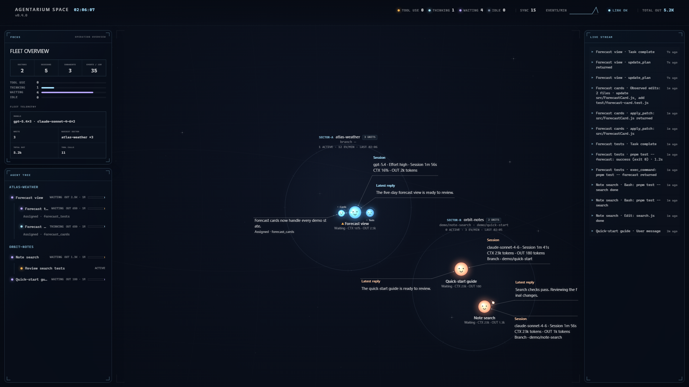

# Agentarium Space

**English** | [日本語](./README.ja.md)

A desktop app for Windows and macOS that lets you watch local **Claude Code** and
**Codex CLI** sessions as glowing creatures beneath a nighttime star chart.

Within each project's "tide pool," glowing session orbs drift slowly. Tool calls
send ripples across the surface, thinking sessions breathe with a soft halo, and
inactive sessions close their eyes and sink toward the edge. Sub-agents appear as
smaller lights orbiting their parent and dissolve into particles when their work is done.

## Demo

[](https://github.com/user-attachments/assets/a169b21c-dd2a-4394-bf39-6629e870cc62)

[Watch the 24-second demo](https://github.com/user-attachments/assets/a169b21c-dd2a-4394-bf39-6629e870cc62) · No audio

Recorded in the app using fictional sessions, prompts, and project paths.
See [how to record the demo](docs/demo.md).

## Install on Windows

Prebuilt releases support Windows 10 or later on x64 PCs. Download
`agentarium-space-<version>-windows-x64.exe` from
[GitHub Releases](https://github.com/yasuhirowevo/agentarium-space/releases), then run it.
It is a portable app: no installer, administrator permission, Node.js, npm, or pnpm is required.

Initial Windows releases are unsigned, so Microsoft SmartScreen may show a warning.
Only continue after verifying that the file came from the official release page.
To upgrade, download the newer EXE from GitHub Releases and replace the older file.

## Install on macOS

Prebuilt releases support macOS 12 Monterey or later on Apple silicon and
Intel Macs. Electron is included, so Node.js is not required. Once the first
release and Homebrew tap update are published, install with:

```bash
brew install --cask yasuhirowevo/tap/agentarium-space
open -a "Agentarium Space"
```

Homebrew Cask distribution does not require the Apple Developer Program.
Releases without the optional Developer ID signing and notarization use only
free ad-hoc signing. `brew install` still completes, but macOS Gatekeeper may
block the first launch. After verifying that the app came from the official
release, try opening it once, then choose **System Settings > Privacy & Security
> Open Anyway**. See [Apple's instructions](https://support.apple.com/102445).
The Cask never removes macOS quarantine automatically.

Upgrade later releases with:

```bash
brew upgrade --cask yasuhirowevo/tap/agentarium-space
```

## Development from source

Node.js 22.13 or later is required. Contributors should use pnpm for the
reproducible lockfile-based setup. To try Agentarium Space without installing
an additional package manager, use the npm version bundled with Node.js.

### npm (quick start)

```bash
npm install
npm start        # Launch the Electron app
npm run web      # Open the per-launch URL printed to the terminal
npm run scan     # Print the current state as JSON for debugging
npm test         # Run the tests
```

### pnpm (use the lockfile)

This repository uses `pnpm-lock.yaml` to pin dependency versions.

```bash
pnpm install --frozen-lockfile
pnpm start        # Launch the Electron app
pnpm run web      # Open the per-launch URL printed to the terminal
pnpm run scan     # Print the current state as JSON for debugging
pnpm test         # Run the tests
```

Environment variables:

- `AGENTARIUM_PORT` — listening port (default: 41414)
- `AGENTARIUM_WINDOW_MIN` — activity retention window, in minutes (default: 60); inactive sessions are displayed for at most 15 minutes
- `AGENTARIUM_DEBUG` — set to 1 to print parser and other debug logs to stderr

## Reading the display

- **Ring (tide pool)** = a project. The project name and Git branch appear at the top center
- **Orb** = a session. Warm colors = Claude Code / cool colors = Codex
- **Ripples + bright core** = a tool is running. Its name and target appear in the nameplate status line
- **Breathing halo** = thinking / **medium glow** = waiting for input / **dimmed + closed eyes** = idle
- **Orbiting smaller lights** = sub-agents. They orbit their parent; a light traveling along the parent link indicates activity
- Inactive sessions fade out after 15 minutes; completed Codex sub-agents and auto-reviews fade out after 60 seconds. Running work and its parents remain within the activity window, and resumed sessions reappear. Keeping a task open in its source app does not extend its display time
- **Nameplate** = the session name and current activity (tool name: target and elapsed time). New messages appear as leader-line callouts
- **Header HUD** = current time / status counts / SYNC (time since the last update) / events-per-minute sparkline / LINK status
- **SECTOR label** = a project's tide pool (`SECTOR-A ─ NAME ─ N UNITS`). The full-height LIVE STREAM module shows recent activity
- Click an orb to open its instrument panel (agent tree / status timeline / cwd / branch / live stream). Runs longer than 10 minutes show `LONG RUN`; disconnections show `LINK LOST`

## How it works

- Tails `~/.claude/projects/**/*.jsonl` and `~/.codex/sessions/**/*.jsonl` in
  **read-only** mode, builds session state, and sends it to the UI over WebSocket
- After launch, the app runs entirely locally: it listens only on 127.0.0.1,
  makes no outbound network requests, and sends no telemetry. Homebrew uses
  the network for installation and upgrades, but the app has no automatic
  updater. A random token is generated for each launch, and HTTP Host /
  WebSocket Origin validation prevents cross-origin reads from other websites
- Stops rendering completely while the window is hidden and supports
  `prefers-reduced-motion`

## Notes

- This is an **unofficial** project and is not affiliated with Anthropic or OpenAI.
  It depends on each CLI's internal log format, so CLI updates may break the display;
  unknown formats are ignored so the app can keep running
- Only use session logs that you are authorized to read
- Background Claude Code sub-agents are tracked through their launch and completion
  notifications. Missing completion notifications leave their status running until
  the session leaves the display window. On initial load of a large log, child
  launches outside the recent tail are not reconstructed
- When logs do not expose a context-window limit, context usage is shown as a
  token count without a percentage ring

## License

[MIT](./LICENSE)
